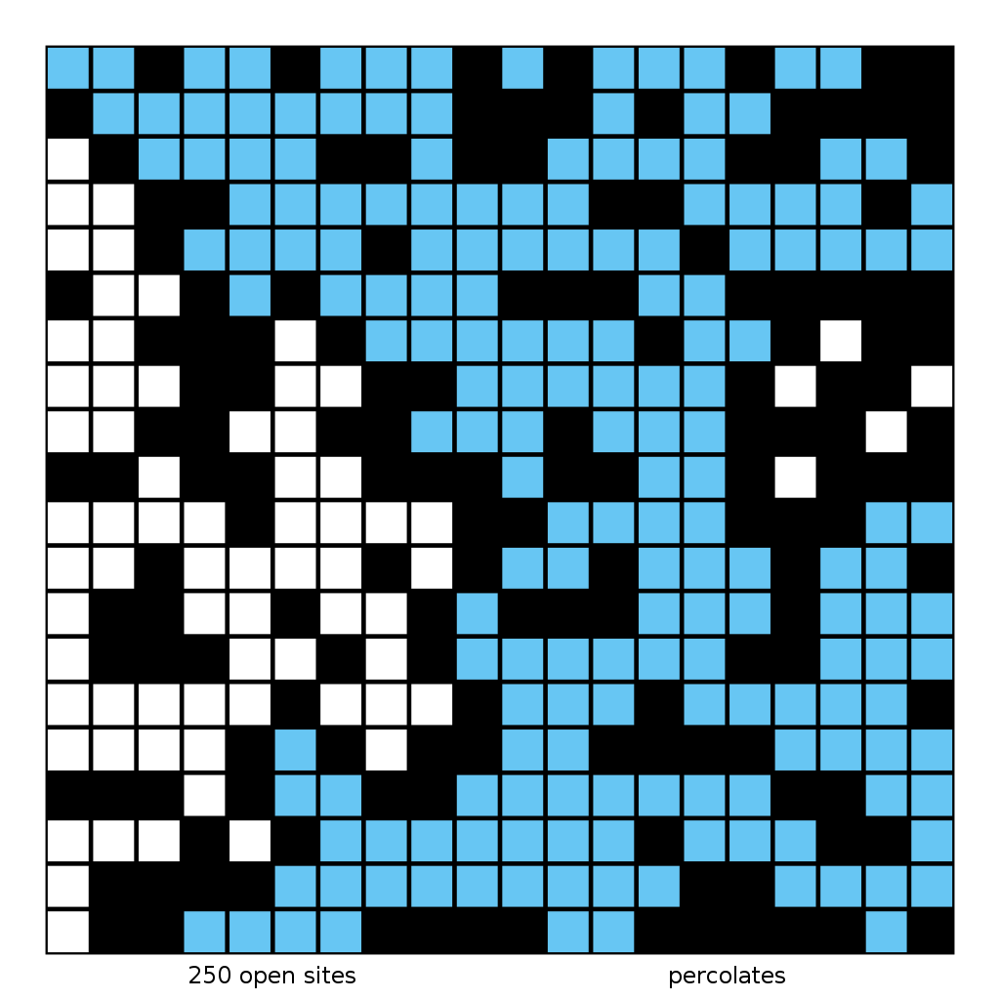

# Percolation

This repository contains the solution to the first programming assignment of Coursera's "Algorithm 1" course ( See https://coursera.cs.princeton.edu/algs4/assignments/percolation/specification.php for reference). The task was to write a percolation class, which decides whether a point is full (i.e. connected to the top) and if there there is a percolation cluster (i.e. a cluster which connects top to bottom).



The visualization client can be run via *bazel run PercolationVisualizer Algorithms/Percolation/data/name_of_sample_file.txt*

The PercolationStats module performs a Monte Carlo Simulation to determine the percolation constant. It takes two arguments, the size of the percolation square, and the number of trials to perform, i.e. *bazel run PercolationStats 100 200* to run 200 trials on 100x100 square lattice. The output will look like this:


```
mean = 0.5922414687499999
stddev = 0.00575935081167536
95% confidence interval = [0.591443263451223, 0.5930396740487769]
elapsed time = 2.471
```
